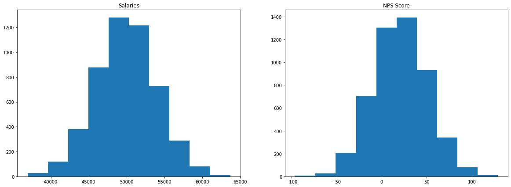
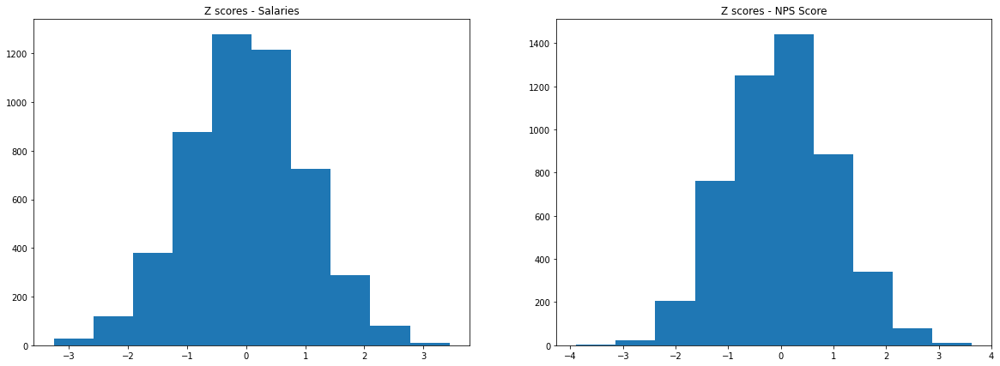
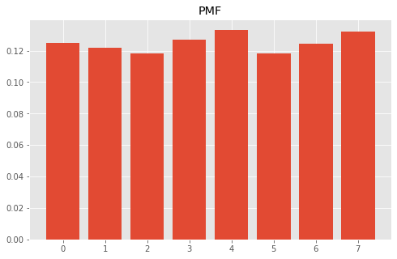

# Objectives
YW
* scrape a website for relevant information, store that information to a dataframe and save that dataframe as a csv file
* load in a dataframe and do the following
    * calculate the zscores of a given column
    * calculate the zscores of a point from a given column in the dataframe
    * calculate and plot the pmf and cdf of another column

# Part 1 - Webscraping
* use the following url scrape the first page of results
* for each item get the name of the item
* store the names to a dataframe and save that dataframe to csv then display
    * store the dataframe in the `data` folder in the repo
    * name the file `part1.csv` and make sure that when you write it you set `index=False`
* the head of the dataframe

* it should match the following


```python
url = "https://www.petsmart.com/dog/treats/dental-treats/#page_name=flyout&category=dog&cta=dentaltreat"
```


```python
# scrape the names of the items on the webpage above
from bs4 import BeautifulSoup
import requests
html_page = requests.get(url)
soup = BeautifulSoup(html_page.content, 'html.parser')
```


```python
warning = soup.find('div', class_="search-result-content")
```


```python
items = warning.findAll('h3')
items
```


    [<h3>Greenies Regular Dental Dog Treats</h3>,
     <h3>Greenies Teenie Dental Dog Treats</h3>,
     <h3>Greenies Large Dental Dog Treats</h3>,
     <h3>Authority<sup>®</sup> Dental &amp; DHA Stick Puppy Treats Parsley Mint - Gluten Free, Grain Free</h3>,
     <h3>Greenies Petite Dental Dog Treats</h3>,
     <h3>WHIMZEES Brushzees Dental Dog Treat - Natural, Grain Free, 1 Count</h3>,
     <h3>Pedigree Dentastix Triple Action Dental Dog Treats - Variety Pack</h3>,
     <h3>Pedigree Dentastix Large Dog Treats</h3>,
     <h3>Pedigree Dentastix Large Dog Sticks</h3>,
     <h3>Authority<sup>®</sup> Dental &amp; DHA Rings Puppy Treats Parsley Mint - Gluten Free, Grain Free</h3>,
     <h3>WHIMZEES Veggie Sausage Dog Dental Treat - Natural, 1 Count</h3>,
     <h3>Pedigree Dentastix Small/Medium Dog Sticks</h3>,
     <h3>WHIMZEES Variety Value Box Dental Dog Treat - Natural, Grain Free</h3>,
     <h3>Greenies Teenie Dog Dental Treats - Blueberry</h3>,
     <h3>Pedigree Dentastix Triple Action Small Dog Treats - Fresh</h3>,
     <h3>Virbac<sup>®</sup> C.E.T.<sup>®</sup> VeggieDent<sup>®</sup> Tartar Control Dog Chews</h3>,
     <h3>Authority Dental &amp; Multivitamin Large Dog Treats Parsley Mint - Gluten Free, Grain Free</h3>,
     <h3>Yummy Combs<sup>®</sup> Ingenious Flossing Dog Dental Treat - 1 Count</h3>,
     <h3>Pedigree Dentastix Large Dog Sticks</h3>,
     <h3>Pedigree Dentastix Mini Dog Sticks</h3>,
     <h3>Ark Naturals<sup>®</sup> Brushless Toothpaste 4-in-1 Large Dog Dental Chews - 40+ lbs.</h3>,
     <h3>Ark Naturals<sup>®</sup> Brushless Toothpaste 4-in-1 Small Dog Dental Chews - 8-20 lbs.</h3>,
     <h3>Authority<sup>®</sup> Dental &amp; Multivitamin Medium Dog Treats Parsley Mint - Gluten Free, Grain Free</h3>,
     <h3>Authority Dental &amp; Multivitamin Small Dog Treats Parsley Mint - Gluten Free, Grain Free</h3>]


```python
# load the data into a dataframe file
import pandas as pd
df = pd.DataFrame([items]).transpose()
df.columns = ['items']
df
```


<div>
<style scoped>
    .dataframe tbody tr th:only-of-type {
        vertical-align: middle;
    }

    .dataframe tbody tr th {
        vertical-align: top;
    }

    .dataframe thead th {
        text-align: right;
    }
</style>
<table border="1" class="dataframe">
  <thead>
    <tr style="text-align: right;">
      <th></th>
      <th>items</th>
    </tr>
  </thead>
  <tbody>
    <tr>
      <th>0</th>
      <td>[Greenies Regular Dental Dog Treats]</td>
    </tr>
    <tr>
      <th>1</th>
      <td>[Greenies Teenie Dental Dog Treats]</td>
    </tr>
    <tr>
      <th>2</th>
      <td>[Greenies Large Dental Dog Treats]</td>
    </tr>
    <tr>
      <th>3</th>
      <td>[Authority, [®],  Dental &amp; DHA Stick Puppy Tre...</td>
    </tr>
    <tr>
      <th>4</th>
      <td>[Greenies Petite Dental Dog Treats]</td>
    </tr>
    <tr>
      <th>5</th>
      <td>[WHIMZEES Brushzees Dental Dog Treat - Natural...</td>
    </tr>
    <tr>
      <th>6</th>
      <td>[Pedigree Dentastix Triple Action Dental Dog T...</td>
    </tr>
    <tr>
      <th>7</th>
      <td>[Pedigree Dentastix Large Dog Treats]</td>
    </tr>
    <tr>
      <th>8</th>
      <td>[Pedigree Dentastix Large Dog Sticks]</td>
    </tr>
    <tr>
      <th>9</th>
      <td>[Authority, [®],  Dental &amp; DHA Rings Puppy Tre...</td>
    </tr>
    <tr>
      <th>10</th>
      <td>[WHIMZEES Veggie Sausage Dog Dental Treat - Na...</td>
    </tr>
    <tr>
      <th>11</th>
      <td>[Pedigree Dentastix Small/Medium Dog Sticks]</td>
    </tr>
    <tr>
      <th>12</th>
      <td>[WHIMZEES Variety Value Box Dental Dog Treat -...</td>
    </tr>
    <tr>
      <th>13</th>
      <td>[Greenies Teenie Dog Dental Treats - Blueberry]</td>
    </tr>
    <tr>
      <th>14</th>
      <td>[Pedigree Dentastix Triple Action Small Dog Tr...</td>
    </tr>
    <tr>
      <th>15</th>
      <td>[Virbac, [®],  C.E.T., [®],  VeggieDent, [®], ...</td>
    </tr>
    <tr>
      <th>16</th>
      <td>[Authority Dental &amp; Multivitamin Large Dog Tre...</td>
    </tr>
    <tr>
      <th>17</th>
      <td>[Yummy Combs, [®],  Ingenious Flossing Dog Den...</td>
    </tr>
    <tr>
      <th>18</th>
      <td>[Pedigree Dentastix Large Dog Sticks]</td>
    </tr>
    <tr>
      <th>19</th>
      <td>[Pedigree Dentastix Mini Dog Sticks]</td>
    </tr>
    <tr>
      <th>20</th>
      <td>[Ark Naturals, [®],  Brushless Toothpaste 4-in...</td>
    </tr>
    <tr>
      <th>21</th>
      <td>[Ark Naturals, [®],  Brushless Toothpaste 4-in...</td>
    </tr>
    <tr>
      <th>22</th>
      <td>[Authority, [®],  Dental &amp; Multivitamin Medium...</td>
    </tr>
    <tr>
      <th>23</th>
      <td>[Authority Dental &amp; Multivitamin Small Dog Tre...</td>
    </tr>
  </tbody>
</table>
</div>


```python
# save the data as a csv file
df.to_csv('data/part1.csv', index=False)
```


```python
# display df.head()
df.head()
```


<div>
<style scoped>
    .dataframe tbody tr th:only-of-type {
        vertical-align: middle;
    }

    .dataframe tbody tr th {
        vertical-align: top;
    }

    .dataframe thead th {
        text-align: right;
    }
</style>
<table border="1" class="dataframe">
  <thead>
    <tr style="text-align: right;">
      <th></th>
      <th>items</th>
    </tr>
  </thead>
  <tbody>
    <tr>
      <th>0</th>
      <td>[Greenies Regular Dental Dog Treats]</td>
    </tr>
    <tr>
      <th>1</th>
      <td>[Greenies Teenie Dental Dog Treats]</td>
    </tr>
    <tr>
      <th>2</th>
      <td>[Greenies Large Dental Dog Treats]</td>
    </tr>
    <tr>
      <th>3</th>
      <td>[Authority, [®],  Dental &amp; DHA Stick Puppy Tre...</td>
    </tr>
    <tr>
      <th>4</th>
      <td>[Greenies Petite Dental Dog Treats]</td>
    </tr>
  </tbody>
</table>
</div>


# Part 2

load in the csv file located in the `data` folder called `part2.csv`

create a function that calculates the zscores of an array

then calculate the zscores for each column in part2.csv and add them as columns

See below for final result


```python
# load in the dataframe, notice it only contains columns salaries, NPS Score, eventOutcome
import pandas as pd
df2 = pd.read_csv('data/part2.csv')
df2.head()
```


<div>
<style scoped>
    .dataframe tbody tr th:only-of-type {
        vertical-align: middle;
    }

    .dataframe tbody tr th {
        vertical-align: top;
    }

    .dataframe thead th {
        text-align: right;
    }
</style>
<table border="1" class="dataframe">
  <thead>
    <tr style="text-align: right;">
      <th></th>
      <th>salaries</th>
      <th>NPS Score</th>
      <th>eventOutcome</th>
    </tr>
  </thead>
  <tbody>
    <tr>
      <th>0</th>
      <td>44112.0</td>
      <td>-7.0</td>
      <td>1</td>
    </tr>
    <tr>
      <th>1</th>
      <td>46777.0</td>
      <td>-12.0</td>
      <td>2</td>
    </tr>
    <tr>
      <th>2</th>
      <td>50013.0</td>
      <td>50.0</td>
      <td>5</td>
    </tr>
    <tr>
      <th>3</th>
      <td>48983.0</td>
      <td>-13.0</td>
      <td>0</td>
    </tr>
    <tr>
      <th>4</th>
      <td>50751.0</td>
      <td>-11.0</td>
      <td>6</td>
    </tr>
  </tbody>
</table>
</div>


```python
import numpy as np
def zscores(arr):
    mean = arr.mean()
    std = arr.std()
    zscores = [(x - mean) / std for x in arr]
    return zscores
```


```python
# calculate the zscore for each column and store them as a new column with the names used above
df2['salaries_zscores'] = zscores(df2['salaries'])
df2['NPS Score_zscores'] = zscores(df2['NPS Score'])
df2['eventOutcome_zscores'] = zscores(df2['eventOutcome'])
df2.head()
```


<div>
<style scoped>
    .dataframe tbody tr th:only-of-type {
        vertical-align: middle;
    }

    .dataframe tbody tr th {
        vertical-align: top;
    }

    .dataframe thead th {
        text-align: right;
    }
</style>
<table border="1" class="dataframe">
  <thead>
    <tr style="text-align: right;">
      <th></th>
      <th>salaries</th>
      <th>NPS Score</th>
      <th>eventOutcome</th>
      <th>salaries_zscores</th>
      <th>NPS Score_zscores</th>
      <th>eventOutcome_zscores</th>
    </tr>
  </thead>
  <tbody>
    <tr>
      <th>0</th>
      <td>44112.0</td>
      <td>-7.0</td>
      <td>1</td>
      <td>-1.460155</td>
      <td>-0.913522</td>
      <td>-1.103166</td>
    </tr>
    <tr>
      <th>1</th>
      <td>46777.0</td>
      <td>-12.0</td>
      <td>2</td>
      <td>-0.793981</td>
      <td>-1.080668</td>
      <td>-0.668095</td>
    </tr>
    <tr>
      <th>2</th>
      <td>50013.0</td>
      <td>50.0</td>
      <td>5</td>
      <td>0.014926</td>
      <td>0.991947</td>
      <td>0.637118</td>
    </tr>
    <tr>
      <th>3</th>
      <td>48983.0</td>
      <td>-13.0</td>
      <td>0</td>
      <td>-0.242545</td>
      <td>-1.114097</td>
      <td>-1.538237</td>
    </tr>
    <tr>
      <th>4</th>
      <td>50751.0</td>
      <td>-11.0</td>
      <td>6</td>
      <td>0.199405</td>
      <td>-1.047239</td>
      <td>1.072189</td>
    </tr>
  </tbody>
</table>
</div>


# Part 3 
plot 'salaries' and 'NPS Score' on a subplot (1 row 2 columns) 
then repeat this for the zscores

see image below for reference


```python
# plot for raw salaries and NPS Score data goes here
import matplotlib.pyplot as plt
%matplotlib inline
fig, (ax1, ax2) = plt.subplots(1, 2, figsize=(20, 7))
ax1.hist(df2['salaries'])
ax2.hist(df2['NPS Score'])
ax1.set_title('Salaries')
ax2.set_title('NPS Score')
plt.show()
```





```python
# plot for zscores for salaries and NPS Score data goes here
fig, (ax1, ax2) = plt.subplots(1, 2, figsize=(20, 7))
ax1.hist(df2['salaries_zscores'])
ax2.hist(df2['NPS Score_zscores'])
ax1.set_title('Z scores - Salaries')
ax2.set_title('Z scores - NPS Score')
plt.show()
```





# Part 4 - PMF
using the column 'eventOutcomes'

create a PMF and plot the PMF as a bar chart

See image below for referenc


```python
def create_pmf(arr):
    n = len(arr)
    d = {}
    for event in arr:
        d[event] = d.get(event,0) +1
    for k,v in d.items():
        d[k] = v/n
    return d
```


```python
pmf = create_pmf(df2['eventOutcome'])
```


```python
# Plot the pmf 
plt.style.use('ggplot')
plt.figure(figsize=(8,5))

plt.bar(pmf.keys(), pmf.values())
plt.title('PMF')
plt.show()

```





# Part 5 - CDF
plot the CDF of Event Outcomes as a scatter plot using the information above

See image below for reference 


# Level Up:
* using np.where find salaries with zscores <= -2.0

* calculate the skewness and kurtosis for the NPS Score column

* plot the pdf and cdf of a given distribution


```python
# find salaries with zscores <= 2.0 
```


```python
# calculate skewness and kurtosis of NPS Score column
```

# Plotting a pdf and cdf of a normal distribution
A survey is taken that finds that students send an mean average of 80 DMs a day with a standard deviation of 6 DMS. 


```python
# plot the pdf and cdf of this normal distribution. level up if you can do it in subplots
```


```python
# what is the probability of drawing a student that sends at least 82 DMs a day?
```

A second survey is taken at another bootcamp that shows that students send a mean average of
80 DMs a day, but they have a standard deviation of 9 DMS.  


```python
# What is the difference in the probability of finding a student that sends, at most, 65 DMs a day? 
```

# run the cell below to convert your notebook to a README for assessment


```python
!jupyter nbconvert --to markdown assessment.ipynb && mv assessment.md README.md
```

    [NbConvertApp] Converting notebook assessment.ipynb to markdown
    [NbConvertApp] Support files will be in assessment_files/
    [NbConvertApp] Making directory assessment_files
    [NbConvertApp] Making directory assessment_files
    [NbConvertApp] Making directory assessment_files
    [NbConvertApp] Writing 13081 bytes to assessment.md


```python

```
